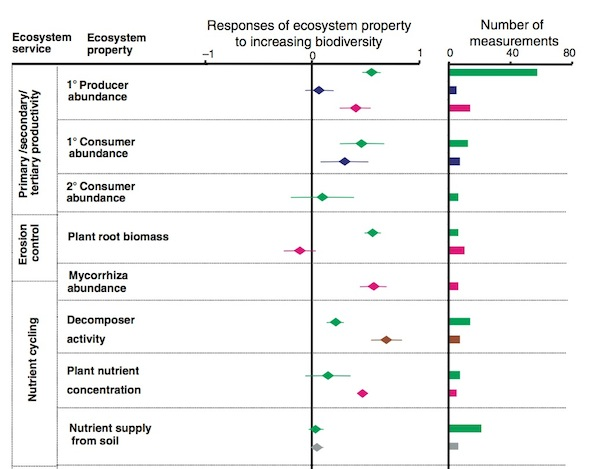
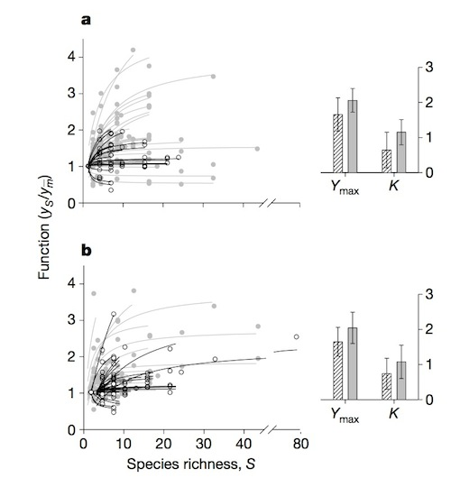
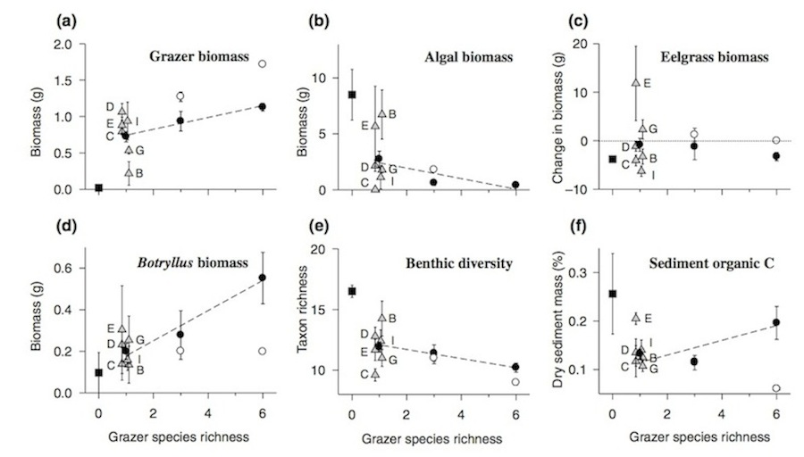
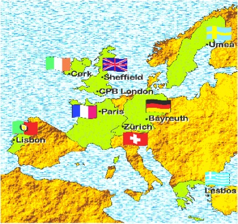
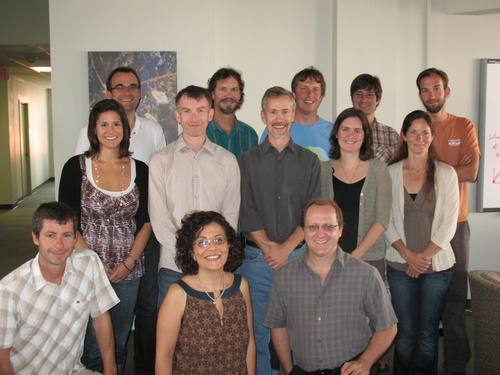

## Meta-analysis Trio: Diversity Affects Function

<table height=100% width=100%><tr>
  <td><br>
  </td>
  <td><br /><br>Balvanera et al. 2006 Eco. Let.</td>
</tr></table>

--- 

## But Are Only Two Species Needed?

<table height=100% width=100%><tr>
  <td><br>Cardinale et al. 2006
  </td>
  <td><br /><br>Balvanera et al. 2006 Eco. Let.</td>
</tr></table>

---bg:url(./images/amphipods.jpg) 

<div class="build"><center></center>

<div style="background-color:grey; color:black; width:220px; margin-width:4px;">Duffy et al. 2003 Ecology Letters</div></div>

---

## 
<center><b><span style="font-size:64pt; font-color:black"><i>Multifunctionality</i>: the simultaneous performance of multiple functions</span></b></center>


---
## How to Measure Multifunctionality 
> 1. Past Methods of 'Measuring' Multifunctionality
> 2. At the Threshold of a Solution
> 3. Future Explorations of BEMF


---

## An Example: Biodepth 
<center>

<center></center>

</center>


---

## Functions Measured in Germany
<center>
```{r functions, echo=FALSE, fig.width=12, fig.height=6}
germanyForPlotting<-melt(germany[,c(8,which(names(germany) %in% vars))], id.vars="Diversity")
germanyForPlotting$variable <- factor(germanyForPlotting$variable)

#make the levels of the functions into something nice for plots
levels(germanyForPlotting$variable) <- c('Aboveground Biomass', 'Root Biomass', 'Cotton Decomposition', 'Soil Nitrogen', 'Plant Nitrogen')

germanyFits <- dlply(germanyForPlotting, .(variable), function(x) lm(value ~ Diversity, data=x))

germanyLabels <- data.frame(variable = levels(germanyForPlotting$variable), 
                            Diversity=7, value=c(2000, 1200, 1.5, 6, 20), 
                            lab=paste(letters[1:5], ")", sep=""),
                            r2 = sapply(germanyFits, function(x) summary(x)$r.squared),
                            p = sapply(germanyFits, function(x) anova(x)[1,5])
                            )


german_functions <- ggplot(aes(x=Diversity, y=value),data=germanyForPlotting) +
  geom_point(size=4)+
  facet_wrap(~variable, scales="free") +
  theme_bw(base_size=20)+
  stat_smooth(method="lm", colour="black", size=2) + 
  xlab("\nSpecies Richness") +
  ylab("Value of Function\n") +
 theme(panel.grid = element_blank())

german_functions

```
</center>

---

## Different Ways of Measuring Multifunctionality 
1. Overlap in Species Influencing Function
2. Average Function
3. Number of Functions Performing at a _Threshold_

---

## Overlap in Species Influencing Function

<center>
```{r overlap, echo=FALSE, warning=FALSE, fig.height=6, fig.width=10}
redund<-getRedundancy(vars, species, germany)
posCurve<-divNeeded(redund, type="positive")
posCurve$div<-posCurve$div/ncol(redund)
pc<-qplot(nfunc, div, data=posCurve, group=nfunc,  alpha=I(0))+
  geom_jitter(size=4, position = position_jitter(height=0.001, width = .05))+
  ylab("Fraction of Species Pool\nwith Positive Effect\n")+ 
  xlab("\nNumber of Functions")+theme_bw(base_size=24)+ylim(c(0,1))

pc
```
</center>

<div class="build"><center><font color='red'>This is not a measure of Multifunctionality</font></center></div>

---

## Average of Standardized Function

<center>
```{r, echo=FALSE, warning=FALSE, fig.height=6, fig.width=10}
germany<-cbind(germany, getStdAndMeanFunctions(germany, vars))
ggplot(aes(x=Diversity, y=meanFunction),data=germany)+geom_point(size=3)+
  theme_bw(base_size=15)+
  stat_smooth(method="lm", colour="black", size=2) + 
  xlab("\nSpecies Richness") +
  ylab("Average Value of Standardized Functions\n")
```
</center>
<div class="build"><center><font color='red'>Many results lead to the same line</font></center></div>

---

## Number of Functions Performing at a _Threshold_

<center>
```{r, echo=FALSE, warning=FALSE, fig.height=6, fig.width=10}
germanyThresh<-getFuncsMaxed(germany, vars, threshmin=0.05, threshmax=0.99, prepend=c("plot","Diversity"), maxN=7)

gcPlot<-subset(germanyThresh, germanyThresh$thresholds==0.8) 

gcPlot$percent<-paste(100*gcPlot$thresholds, "%", sep="")

qplot(Diversity, funcMaxed, data=gcPlot, size=I(3)) +
  stat_smooth(method="glm", family=quasipoisson(link="identity"), colour="red", lwd=1.2) +
  ylab(expression("Number of Functions" >= Threshold)) +
  xlab("Species Richness") +
  theme_bw(base_size=22) 

```
</center>
<div class="build"><center><font color='red'>Threshold may be arbitrary</font></center></div>

---
## How to Measure Multifunctionality 
1. Past Methods of 'Measuring' Multifunctionality
2. <font color=red>At the Threshold of a Solution</font>
3. Future Explorations of BEMF

---
## Thresholds Seem Arbitrary
<center>
```{r, echo=FALSE}

gcPlot<-subset(germanyThresh, germanyThresh$thresholds %in% qw(0.2, 0.4, 0.6, 0.8)) #note, using qw as %in% is a string comparison operator

gcPlot$percent<-paste(100*gcPlot$thresholds, "%", sep="")

qplot(Diversity, funcMaxed, data=gcPlot, facets=~percent, size=I(3)) +
  stat_smooth(method="glm", family=quasipoisson(link="identity"), colour="red", lwd=1.2) +
  ylab(expression("Number of Functions" >= Threshold)) +
  xlab("Species Richness") +
  theme_bw(base_size=22) 
```
</center>

---

## Slope Changes Systematically Across Thresholds

<center>
```{r, echo=FALSE, fig.height=6, fig.width=10, fig.align='center'}
germanyLinearSlopes<-getCoefTab(funcMaxed ~ Diversity, data=germanyThresh, coefVar="Diversity", family=quasipoisson(link="identity"))

germanyThresh <- getFuncsMaxed(germany, vars, threshmin=0.05, threshmax=0.99, prepend=c("plot","Diversity"), maxN=7)

germanyThresh$percent <- 100*germanyThresh$thresholds

germanIDX <- getIndices(germanyLinearSlopes, germanyThresh, funcMaxed ~ Diversity)

germanyThresh$IDX <- 0
germanyThresh$IDX [which(germanyThresh$thresholds %in% 
                           c(germanIDX$Tmin, germanIDX$Tmax, germanIDX$Tmde))] <- 1


germanLines <- 
  ggplot(data=germanyThresh, aes(x=Diversity, y=funcMaxed, group=percent)) +
    ylab(expression("Number of Functions" >= Threshold)) +
    xlab("Species Richness") +
    stat_smooth(method="glm", family=quasipoisson(link="identity"),  fill=NA, aes(color=percent), lwd=0.3) +
    theme_bw(base_size=22) +
    scale_color_gradient(name="Percent of \nMaximum", low="blue", high="red")

germanLines+
  annotate(geom="text", x=0, y=c(0.5,1.5,3.7), label=c("    ", "    ", "    ")) +
  annotate(geom="text", x=16.7, y=c(germanIDX$Mmin, germanIDX$Mmax, germanIDX$Mmde), label=c("   ", "    ", "    "))
```   

</center>

---

## Slope Changes Systematically Across Thresholds

<center>
```{r, echo=FALSE, fig.height=7, fig.width=12, fig.align='center'}
germanLines + 
  geom_smooth(method="glm", family=quasipoisson(link="identity"), 
              fill=NA, aes(color=percent), data=germanyThresh[which(germanyThresh$IDX>0),], lwd=8) +
  annotate(geom="text", x=0, y=c(0.25,2,4.7), label=c("Tmax", "Tmde", "Tmin"), size=8) +
  annotate(geom="text", x=16.75, y=c(germanIDX$Mmin, germanIDX$Mmax, germanIDX$Mmde), label=c("Mmin", "Mmax", "Mmde"), size=7)
```

</center>

---

## Slope Changes Systematically Across Thresholds
<center>

```{r, echo=FALSE, fig.height=7, fig.width=12, cache=TRUE}

germanSlopes <- ggplot(germanyLinearSlopes, aes(x=thresholds)) +
  geom_ribbon(fill="grey50", aes(x=thresholds*100, ymin=Estimate-1.96*germanyLinearSlopes[["Std. Error"]], 
                                  ymax=Estimate+1.96*germanyLinearSlopes[["Std. Error"]])) +
  geom_point(aes(x=thresholds*100, y=Estimate)) +
  ylab("Change in Number of Function\n per Addition of 1 Species\n") +
  xlab("\nThreshold (%)") +
  stat_abline(intercept=0, slope=0, lwd=1, linetype=2) +
  theme_bw(base_size=22)

germanSlopes + 
  annotate(geom="text", y=c(-0.02, -0.02, -0.02, germanIDX$Rmde.linear+0.02), x=c(germanIDX$Tmin*100, germanIDX$Tmde*100, germanIDX$Tmax*100, germanIDX$Tmde*100),  label=c("Tmin", "Tmde", "Tmax", "Rmde"), color="black", size=8) 
```

</center>

---
## How to Measure Multifunctionality 
1. Past Methods of 'Measuring' Multifunctionality
2. At the Threshold of a Solution
3. <font color="red">Future Explorations of BEMF</font>


---
## Comparing Systems

```{r, error=FALSE, echo=FALSE, warning=FALSE, fig.height=7, fig.width=12, cache=TRUE}

####
# Now we will look at the entire BIODEPTH dataset
#
# Note the use of ddply from plyr to generate the new data frame using all locations from biodepth.
# If you're not using plyr for your data aggregation, you should be.  http://plyr.had.co.nz/
# It will save you a lot of time and headaches in the future.
####

#Read in data  to run sample analyses on the biodepth data
allVars<-qw(biomassY3, root3, N.g.m2,  light3, N.Soil, wood3, cotton3)
varIdx<-which(names(sub_biodepth) %in% allVars)


#re-normalize so that everything is on the same sign-scale (e.g. the maximum level of a function is the "best" function)
sub_biodepth<-ddply(all_biodepth, .(location), function(adf){
  adf$light3<- -1*adf$light3+max(adf$light3, na.rm=T)
  adf$N.Soil<- -1*adf$N.Soil +max(adf$N.Soil, na.rm=T)
  
  adf
})


#get thresholds
bdThreshes<-ddply(sub_biodepth, .(location), function(x) getFuncsMaxed(x, vars=allVars, prepend=c("plot","Diversity"), maxN=8))


####look at slopes

#note, maxIT argument is due to some fits needing more iterations to converge
bdLinearSlopes<-getCoefTab(funcMaxed ~ Diversity, data=bdThreshes, groupVar=c("location", "thresholds"), 
                           coefVar="Diversity", family=quasipoisson(link="identity"), control=list(maxit=800))


indexTable <- lapply(levels(bdLinearSlopes$location), function(x){
  slopedata <- subset(bdLinearSlopes, bdLinearSlopes$location==x) 
  threshdata <- subset(bdThreshes, bdThreshes$location==x) 
  ret <- getIndices(slopedata, threshdata, funcMaxed ~ Diversity)
  ret<-cbind(location=x, ret)
  ret
})
indexTable <- ldply(indexTable)

indexTable$Mmin[which(is.na(indexTable$Mmin))]<-indexTable$nFunc[which(is.na(indexTable$Mmin))]
indexTable$Tmin[which(is.na(indexTable$Tmin))]<-0

indexTable$Mmin <- round(indexTable$Mmin)


indexTable$Tmde=indexTable$Tmde*100
indexTable$Tmax=indexTable$Tmax*100
indexTable$Tmin=indexTable$Tmin*100

#figure
names(bdLinearSlopes) <- c("location", "thresholds", "Estimate", "StdError", "tvalue", "p")
bdLinearSlopes$thresholds <- bdLinearSlopes$thresholds*100

bdLinearSlopes <- bdLinearSlopes[-which(is.na(bdLinearSlopes$Estimate)),]

ggplot(data=bdLinearSlopes, aes(x=thresholds, y=Estimate)) +
  geom_ribbon(mapping= aes(x=thresholds,
                  ymin=Estimate-1.96*StdError,
                  ymax=Estimate+1.96*StdError), fill="grey50") +
  geom_point(size=2.2) +
  ylab("Change in Number of Functions \nper Addition of 1 Species\n") +
  xlab("\nThreshold (%)") +
  facet_wrap(~location)+#, scale="free") +
  stat_abline(intercept=0, slope=0, lwd=0.6, linetype=2) +
  theme_bw(base_size=22)

#slopePlot
```

---
## Comparing Systems Behaviour
<center>
```{r, echo=FALSE, fig.height=7, fig.width=12}
qplot(Tmax, Mmax/nFunc*100, size=Rmde.linear, 
      data=indexTable, geom="point", color=Tmde) + 
  geom_text(data=indexTable, aes(x=Tmax-2, y=100*Mmax/nFunc+4, label=location), size=I(5)) +
 # scale_color_discrete(guide=FALSE) +
  theme_bw(base_size=24) +
  xlab("\nHighest Threshold with a Diversity Effect") +
  ylab("Percentage of Functions Maximized\n") +
  scale_size_continuous("Slope of Strongest Observed\nDiversity Effect") +
  xlim(c(40,100)) +
  ylim(c(0,110))

```
</center>

---

## Assessing Generality of Metrics

<center>

```{r, echo=FALSE, fig.height=7, fig.width=12}

colci <- function(atab){
  ldply(apply(atab,2,function(x) mean_cl_boot(x)))
}

indexTable2 <- indexTable[,-10]
indexTable2$Mmin <- indexTable$Mmin/indexTable$nFunc*100
indexTable2$Mmax <- indexTable$Mmax/indexTable$nFunc*100
indexTable2$Mmde <- indexTable$Mmde/indexTable$nFunc*100
indexTable2$Pmde.linear <- indexTable$Pmde.linear*100

indexTable2 <- data.frame(Mean=colMeans(indexTable2[,-1]),
                           lower.CI = colci(indexTable2[,-1])[,3],
                           upper.CI = colci(indexTable2[,-1])[,4])


indexTable2$metric <- rownames(indexTable2)

indexSummary <- indexTable2[c(3:2,8:7),]
indexSummary$metric <- factor(indexSummary$metric, levels=indexSummary$metric)
indexSummary$Type="Max Threshold"
indexSummary$Type[grep("mde", indexSummary$metric)] <- "Strongest Diversity Effect"

ggplot(indexSummary, aes(x=metric, y=Mean, ymin=lower.CI, ymax=upper.CI)) +
  geom_point(size=4)+
  geom_linerange(size=1) +
  theme_bw(base_size=24) +
  xlab("") +
  ylab("Percentage\n") +
  stat_hline(yintercept=0, lwd=2, lty=2) +
  facet_wrap(~Type, scale="free_x") +
  ylim(c(0,100))
```

</center>

---
## How do We Measure Multifunctionality? 
> 1. Multifunctionality is a nuanced phenomenon
> 2. Multiple methods in the literature address different aspects of multifunctionality 
> 3. Examining the relationship between diversity and # of Functions > a threshold at multiple thresholds provides new promising metrics
<br />
<div class="build"><center><font color='red'>These methods not limited to biodiversity-ecosystem function research</font></center></div>

---
## Thanks to NCEAS & the BEF Working Group 
<center>

</center>
Paper: [http://bit.ly/multifunc](http://bit.ly/multifunc) 
<br>
R Multifunc Library: [https://github.com/jebyrnes/multifunc](https://github.com/jebyrnes/multifunc)
<br>


