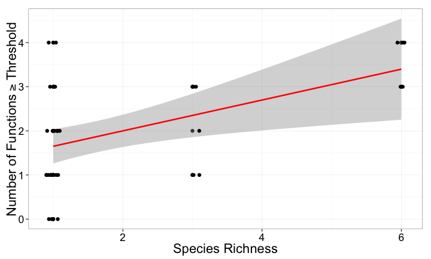

## Meta-analysis Trio: Diversity Affects Function

<table height=100% width=100%><tr>
  <td> 
  </td>
  <td>  Balvanera et al. 2006 Eco. Let.</td>
</tr></table>

--- 

## But Are Only Two Species Needed?

<table height=100% width=100%><tr>
  <td> Cardinale et al. 2006
  </td>
  <td>  Balvanera et al. 2006 Eco. Let.</td>
</tr></table>

---bg:url(./images/amphipods.jpg) 

Duffy et al. 2003 Ecology Letters

---

## 

<b><i>Multifunctionality</i>: the simultaneous performance of multiple functions</b>

---
## How to Measure Multifunctionality 
> 1. Past Methods of 'Measuring' Multifunctionality
> 2. At the Threshold of a Solution
> 3. Future Explorations of BEMF

---

## An Example: Biodepth 

---

## Functions Measured in Germany

 

---

## Different Ways of Measuring Multifunctionality 
1. Overlap in Species Influencing Function
2. Average Function
3. Number of Functions Performing at a _Threshold_

---

## Overlap in Species Influencing Function

 

This is not a measure of Multifunctionality

---

## Average of Standardized Function

 

Many results lead to the same line

---

## Number of Functions Performing at a _Threshold_

 

Threshold may be arbitrary

---
## How to Measure Multifunctionality 
1. Past Methods of 'Measuring' Multifunctionality
2. At the Threshold of a Solution
3. Future Explorations of BEMF

---
## Thresholds Seem Arbitrary

 

---

## Slope Changes Systematically Across Thresholds

 

---

## Slope Changes Systematically Across Thresholds

 

---

## Slope Changes Systematically Across Thresholds

 

---
## How to Measure Multifunctionality 
1. Past Methods of 'Measuring' Multifunctionality
2. At the Threshold of a Solution
3. Future Explorations of BEMF

---
## Comparing Systems

 

---
## Comparing Systems Behaviour

 

---

## Assessing Generality of Metrics

 

---
## How do We Measure Multifunctionality? 
> 1. Multifunctionality is a nuanced phenomenon
> 2. Multiple methods in the literature address different aspects of multifunctionality 
> 3. Examining the relationship between diversity and # of Functions > a threshold at multiple thresholds provides new promising metrics
 

These methods not limited to biodiversity-ecosystem function research

---
## Thanks to NCEAS & the BEF Working Group 

Paper: [http://bit.ly/multifunc](http://bit.ly/multifunc) 
 
R Multifunc Library: [https://github.com/jebyrnes/multifunc](https://github.com/jebyrnes/multifunc)
 

